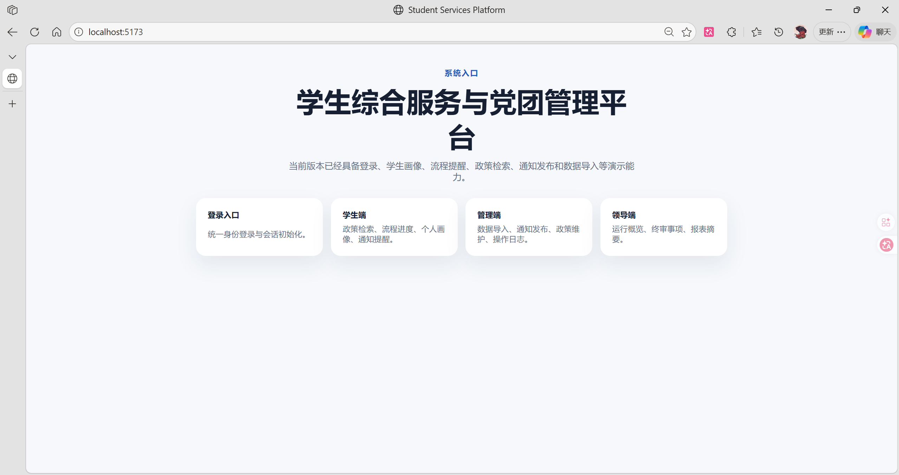

# 学生综合服务与党团管理平台部署验证报告

## 1. 概要

- 项目能够在电脑端成功启动
- 项目首页能够在本机浏览器正常访问
- 项目能够通过局域网地址被另一台设备访问
- 手机端能够成功打开同一套前端页面，证明系统具备跨设备访问能力

## 2. 验证环境

### 2.1 部署机器

- 操作系统：Windows
- 部署目录：`Student-Services-and-Party-Youth-League-Management-Platform`
- 依赖中间件：PostgreSQL、Redis、MinIO
- 中间件启动方式：Docker Compose
- 后端服务：NestJS
- 前端服务：Vite 开发服务

### 2.2 访问方式

- 电脑端访问地址：`http://localhost:5173`
- 手机端访问地址：`http://192.168.0.104:5173/`

说明：

- `5173` 为前端 Vite 服务端口
- 手机端访问使用的是部署机器的局域网 IP
- 这说明前端服务已经成功暴露到局域网

## 3. 部署方式说明

本次验证采用的是“局域网演示部署”方式，整体结构如下：

1. 使用 Docker Compose 启动数据库和基础依赖服务
2. 使用 NestJS 在本机启动后端接口服务
3. 使用 Vite 在本机启动前端服务，并通过 `--host 0.0.0.0` 暴露到局域网
4. 手机与电脑连接同一局域网，通过电脑的局域网 IP 访问前端页面
5. 前端通过 `/api` 代理调用本机后端接口

## 4. 服务启动步骤

### 4.1 启动 Docker 依赖服务

在项目根目录执行：

```powershell
docker compose -f infra\docker-compose.yml up -d
```

该命令会启动：

- PostgreSQL
- Redis
- MinIO

可使用以下命令查看状态：

```powershell
docker compose -f infra\docker-compose.yml ps
```

### 4.2 初始化数据库

在项目根目录执行：

```powershell
npm.cmd run prisma:generate
npm.cmd run prisma:migrate
npm.cmd run prisma:seed
```

作用如下：

- `prisma:generate`：生成 Prisma Client
- `prisma:migrate`：应用数据库迁移
- `prisma:seed`：写入中文演示数据，包括账号、学生、政策、通知等内容

### 4.3 启动后端服务

在项目根目录执行：

```powershell
npm.cmd run dev:backend
```

后端默认监听：

```text
http://127.0.0.1:3001
```

健康检查接口：

```text
http://127.0.0.1:3001/api/health
```

### 4.4 启动前端服务并暴露局域网访问

在项目根目录执行：

```powershell
npm.cmd --workspace frontend run dev -- --host 0.0.0.0 --port 5173
```

说明：

- `--host 0.0.0.0` 是本次跨设备访问验证的关键参数
- 如果不加这一项，前端通常只能被本机访问，手机无法打开

本机访问地址：

```text
http://localhost:5173
```

手机访问地址格式：

```text
http://<电脑局域网IP>:5173
```

本次验证中，局域网地址为：

```text
http://192.168.0.104:5173/
```

## 5. 电脑端访问结果

电脑端浏览器成功打开系统首页，页面正常显示中文标题、模块入口和说明信息。

验证截图如下：



从截图可以确认：

- 页面已经在电脑端正常启动
- 前端服务运行在 `localhost:5173`
- 首页中文内容显示正常
- 登录入口、学生端、管理端、领导端四个模块入口均已可见

## 6. 手机端访问结果

手机端浏览器通过局域网地址 `192.168.0.104:5173` 成功访问系统首页。

验证截图如下：


从截图可以确认：

- 手机端不是访问 `localhost`
- 手机端访问的是电脑局域网地址 `192.168.0.104:5173`
- 手机页面已经成功加载首页内容
- 页面在移动端具备基本可读性和可访问性

这说明：

- 前端服务已经成功监听外部访问
- 电脑与手机之间的局域网访问链路是通的
- 系统已经具备“在另一台设备上访问”的部署验证结果

## 7. 验证结论

本次部署验证结论为：`通过`。

通过依据如下：

- 电脑端可以成功启动并访问系统首页
- 手机端可以通过局域网地址访问同一系统
- 页面内容在电脑端和手机端均可正常显示
- 系统已经满足“部署后可在其他设备访问”的验证要求
