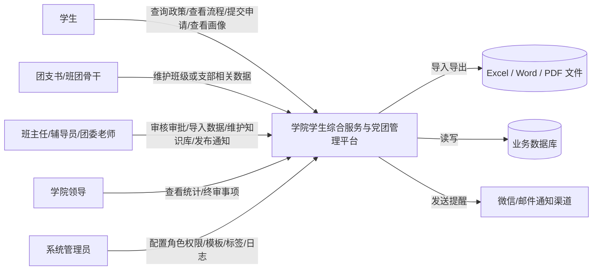
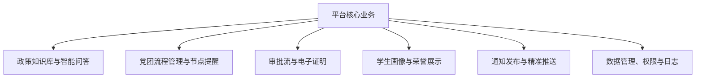
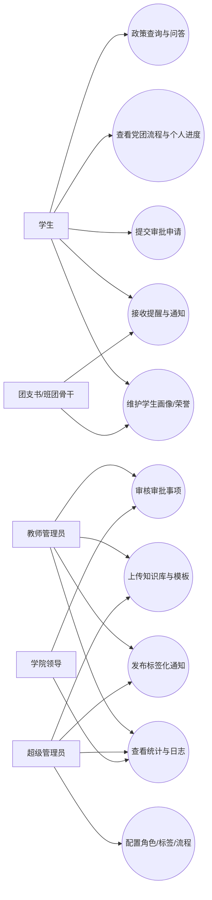
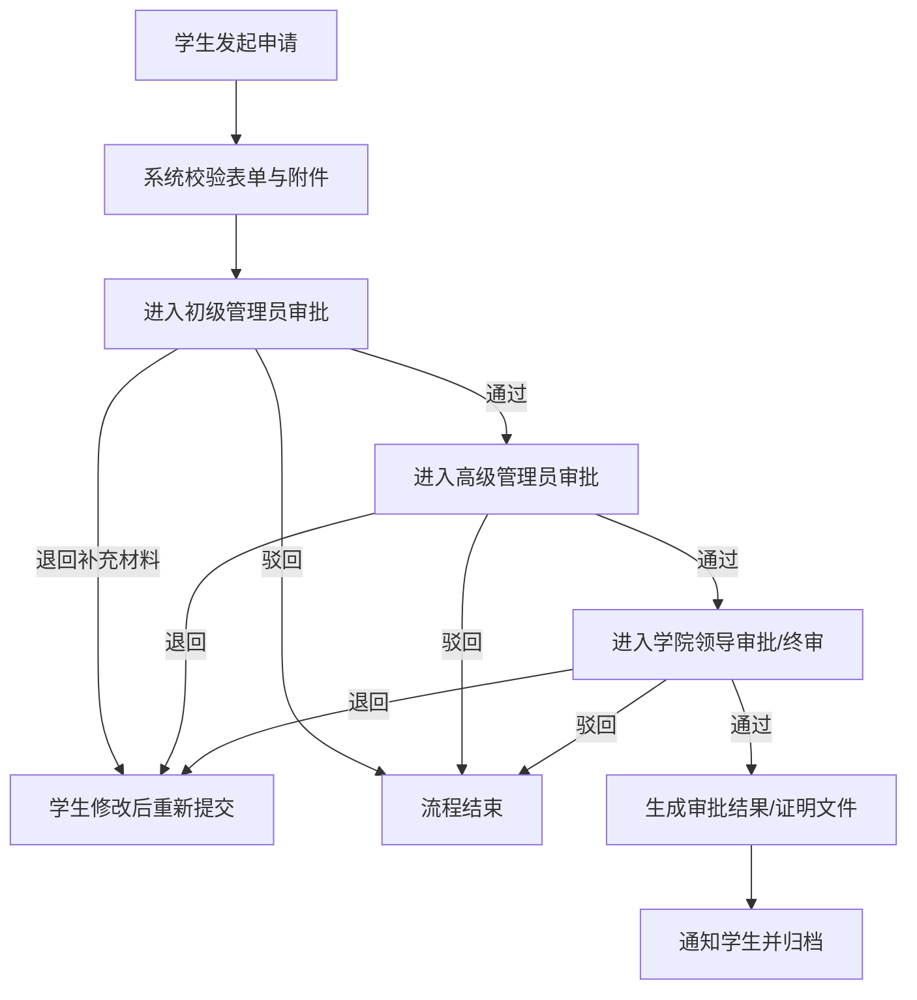
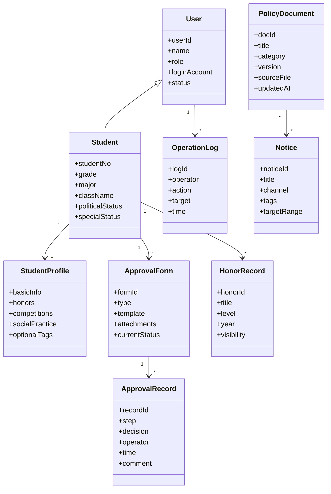

# 学院学生综合服务与党团管理平台需求分析

## 1. 文档说明

本文档基于 `./软工导/需求` 目录下的产品需求文档、会议纪要、会议转写、问题收集表、需求整理材料，以及 `./软工导/需求分析方法.pdf` 中的结构化需求分析与面向对象需求分析方法整理而成。

分析思路遵循课程材料中的两个核心视角：

1. 结构化视角：梳理系统边界、外部实体、数据流、业务流程与数据字典。
2. 面向对象视角：梳理角色、用例、关键对象及其关系。

本文既给出需求规格，也给出面向课程作业可落地的范围裁剪建议。

## 2. 项目背景与问题陈述

当前学院学生事务与党团管理工作主要依赖人工处理、微信群转发与分散文件流转，存在以下问题：

- 学生频繁重复咨询政策、流程、资格与材料要求。
- 入党入团、请假、盖章等事项缺乏统一入口与进度跟踪。
- 学生基础信息、荣誉信息、特殊学籍状态分散在 Excel/Word/PDF 中，维护与查询成本高。
- 通知分发依赖人工转发，缺少按年级、专业、身份标签的精准触达能力。
- 涉及身份证号、学籍状态等敏感数据时，缺乏统一权限控制和日志追踪。

因此，项目目标是建设一个面向学院场景的“一站式学生综合服务与党团管理平台”，提升日常事务处理效率，降低老师重复答疑负担，并为学生提供统一、清晰、可追踪的服务入口。

## 3. 目标与建设原则

### 3.1 建设目标

- 为学生提供统一入口，集中处理政策查询、流程查看、申请提交、通知接收与个人信息展示。
- 为教师提供统一后台，完成数据导入、知识库维护、审批流转、消息发布和统计查询。
- 在一学期课程作业周期内，优先实现高频、刚需、可演示的核心功能。

### 3.2 建设原则

- 实用优先：优先解决高频重复问题，而不是追求大而全。
- 安全优先：敏感数据最小可见、分级授权、可审计。
- 渐进实现：先完成 P0/P1 核心闭环，再为后续迭代保留扩展点。
- 数据可维护：系统要支持老师持续上传与维护知识库、模板和业务数据。

## 4. 需求来源概览

### 4.1 原始材料

- 产品需求文档：给出五大模块的初步设想。
- 会议纪要：明确优先级、权限、安全与平台形态的取舍。
- 会议转写：补充了角色划分、审批链、通知渠道、数据来源、特殊身份处理等细节。
- 问题收集表：反映了团队对边界、约束与风险的集中关注。
- 需求整理脑图：对需求做了高度浓缩的归纳。

### 4.2 关键结论

- 核心用户规模约为 `1000+` 名学生，管理员约 `10` 人左右。
- 当前无法将“直接对接微人大接口”作为硬性前提，系统需要支持基于 `Excel/Word/PDF` 的导入与维护。
- 智能问答知识库与党团流程管理为最高优先级。
- 学业预警功能风险高、依赖外部数据强，宜降级或延期。
- 平台既要兼顾手机端高频轻操作，也要兼顾电脑端复杂管理操作。
- 产品形态不应被强行绑定为微信小程序，网页形态可接受，且更利于降低技术复杂度。

## 5. 业务范围与边界

### 5.1 系统边界

系统面向学院内部使用，服务对象包括学生、团学骨干、班主任/辅导员、学院领导和系统管理员。系统不直接替代学校教务系统，也不直接依赖校级“微人大”开放接口。

### 5.2 建议纳入范围

- 政策知识库与智能问答
- 党团流程展示与阶段提醒
- 基础审批流与电子证明辅助生成
- 学生画像与荣誉展示
- 通知发布、标签分发与消息提醒
- 数据导入导出、权限控制、操作日志

### 5.3 建议暂缓或弱化范围

- 全自动抓取微信公众号内容
- 直接对接微人大或教务核心接口
- 复杂学分核算与自动选课推荐
- 真实短信网关的正式落地
- 学生端批量导入、批量导出敏感数据

## 6. 总体业务图示

### 6.1 讨论摘要图

下图来自现有需求整理材料，可作为原始需求的总览参考：

### 6.2 系统上下文图（顶层数据流图）

### 6.3 一级业务分解图

## 7. 利益相关者与角色分析

### 7.1 主要利益相关者

- 学生：希望快速获得政策答案、办理事务、查看进度、接收精准通知。
- 团支书/班团骨干：需要一定范围内的信息维护和组织事务支撑能力。
- 班主任/辅导员/团委老师：是系统的主要运营者和审批者。
- 学院领导：关注审批结果、统计情况和治理效率。
- 系统管理员：负责配置、导入、维护、授权和审计。

### 7.2 角色分层建议

结合会议材料，系统建议采用四级权限体系：

| 角色级别 | 典型角色 | 主要权限 |
| --- | --- | --- |
| R1 普通用户 | 学生 | 查询、提交、查看个人数据与个人进度 |
| R2 组织协作者 | 团支书、班团骨干 | 维护授权范围内的组织信息，查看非敏感公共数据 |
| R3 业务管理员 | 班主任、辅导员、团委老师 | 审核、发布通知、导入数据、维护模板与知识库 |
| R4 超级管理员 | 指定管理员 | 用户授权、流程配置、标签配置、数据治理、日志审计 |

### 7.3 权限控制原则

- 班主任原则上只查看本班级或本年级数据。
- 助教原则上不开放审批权限。
- 学生只能查看本人数据，不得导出全量数据。
- 敏感数据仅管理员可见，且需记录访问与操作日志。
- 谁上传、谁维护，是数据维护的重要责任原则。

## 8. 需求优先级分析

### 8.1 优先级定义

- `P0`：必须实现，否则系统核心价值无法成立。
- `P1`：应当实现，显著增强系统完整度与展示效果。
- `P2`：可延后实现，风险较高或依赖外部条件。

### 8.2 模块优先级

| 模块 | 优先级 | 说明 |
| --- | --- | --- |
| 政策知识库与智能问答 | P0 | 直接解决重复咨询问题，是老师明确认可的高频刚需 |
| 党团流程管理与节点提醒 | P0 | 流程稳定、规则明确、展示价值高 |
| 审批流与电子证明 | P1 | 事务数字化的重要组成部分，可做基础闭环 |
| 学生画像与荣誉展示 | P1 | 有助于信息整合与成果展示 |
| 通知发布与精准推送 | P1 | 提升信息触达效率，但建议先做手工维护版本 |
| 学业分析与预警 | P2 | 数据风险高、规则复杂、责任边界不清 |

### 8.3 建议的课程作业 MVP

- P0 全部
- P1 中的“基础审批流”“学生画像”“荣誉展示”“通知发布”
- P2 仅保留概念设计，不做深度落地

## 9. 用例视角分析

### 9.1 主要用例图

### 9.2 关键用例说明

| 用例编号 | 用例名称 | 参与者 | 简述 |
| --- | --- | --- | --- |
| UC-01 | 政策查询与问答 | 学生 | 学生输入问题或关键词，系统返回标准答案、流程说明或原文链接 |
| UC-02 | 查看党团流程与进度 | 学生 | 学生查看当前所处阶段、已完成事项与后续提醒 |
| UC-03 | 提交审批申请 | 学生 | 学生按模板提交请假、盖章、证明等申请 |
| UC-04 | 审核审批事项 | 教师、领导 | 管理员按权限进行分级审批、退回、撤回或重批 |
| UC-05 | 维护知识库与模板 | 教师、管理员 | 上传政策文件、模板文件并维护版本 |
| UC-06 | 发布精准通知 | 教师、管理员 | 根据标签选择目标人群并发送站内/微信/邮件提醒 |
| UC-07 | 管理学生画像与荣誉 | 学生、干部、教师 | 维护基础资料、荣誉信息和展示内容 |

## 10. 行为视角分析

### 10.1 核心审批流程

### 10.2 审批行为规则

- 支持分级审批：初级管理员 -> 高级管理员 -> 学院领导。
- 支持退回补充材料。
- 支持审批结果在限定时间内撤回或重批。
- 所有审批动作必须保留操作日志。
- 审批记录支持归档和导出。

### 10.3 党团流程提醒规则

- 入党入团流程总体稳定，允许在系统中固化为标准流程。
- 提醒以“阶段节点 + 大致时间窗口”为主，不要求实现复杂自定义流程引擎。
- 提醒可基于固定时间、相对时间或阶段完成状态触发。

## 11. 结构视角分析

### 11.1 概念类图

### 11.2 核心领域对象

- 用户：系统登录与权限控制的基础对象。
- 学生：核心业务主体。
- 学生画像：整合基础信息、荣誉、竞赛、社会实践等内容。
- 政策文档：知识库问答的基础数据对象。
- 审批单：流程驱动对象。
- 审批记录：审批轨迹对象。
- 通知：精准推送的消息对象。
- 操作日志：审计与追责对象。

## 12. 数据分析与数据字典

### 12.1 数据来源

结合需求材料，系统主要数据来源如下：

| 数据类型 | 主要来源 | 说明 |
| --- | --- | --- |
| 学生基础数据 | Excel 导入为主 | 当前更现实的方式 |
| 政策文件 | Word / PDF | 由老师维护上传 |
| 流程材料 | Excel / Word / PDF | 支持模板化 |
| 荣誉与画像数据 | Excel 导入 + 人工补充 | 部分字段可由学生补充 |
| 通知信息 | 管理员录入 / 手工整理链接 | 自动抓取不作为前提 |

### 12.2 核心数据字典

| 数据项 | 说明 | 类型 | 是否敏感 | 备注 |
| --- | --- | --- | --- | --- |
| 学号 | 学生唯一标识 | 字符串 | 否 | 可作为账号绑定主键 |
| 姓名 | 学生姓名 | 字符串 | 否 | 基础展示字段 |
| 年级 | 所属年级 | 字符串 | 否 | 用于标签推送 |
| 专业 | 所属专业 | 字符串 | 否 | 用于标签推送 |
| 班级 | 所属班级 | 字符串 | 否 | 权限范围控制 |
| 身份证号 | 个人身份识别信息 | 字符串 | 是 | 管理员可见 |
| 手机号 | 联系方式 | 字符串 | 是 | 通知触达相关 |
| 特殊学籍状态 | 毕业、休学、退学、转专业等 | 枚举 | 是 | 需保留历史记录 |
| 荣誉记录 | 奖项、称号、年份、级别 | 结构化 | 否/部分 | 展示需用户授权 |
| 审批状态 | 待审、通过、退回、驳回等 | 枚举 | 否 | 流程字段 |
| 政策文档版本 | 文档版本号与更新时间 | 字符串 | 否 | 问答可信度基础 |

### 12.3 数据安全分层

- 可公开字段：学号、民族、班级、专业、年级等基础信息。
- 受限字段：身份证号、手机号、生源地、户籍地、导师信息、休学/延毕记录等。
- 展示字段：荣誉、竞赛、实践信息应允许用户自主选择公开范围。

## 13. 功能需求规格

### 13.1 模块一：政策知识库与智能问答（P0）

#### FR-01 政策文档上传

- 系统应支持教师/管理员上传政策文档。
- 文档格式至少支持 `Word`、`PDF`。
- 单文件建议支持到 `30MB` 左右。
- 系统应记录上传人、上传时间、版本信息。

#### FR-02 政策检索

- 学生可通过关键词搜索政策、流程、模板和说明。
- 系统应返回标准答案、对应文档链接或原文片段。
- 对于敏感问题，系统应优先返回官方链接和标准表述。

#### FR-03 智能问答

- 系统应支持基于知识库的问答。
- 回答应优先依据知识库内容，不鼓励无依据的自由生成。
- 当命中率不足时，应提示“请联系老师/查看原文”。

#### FR-04 知识库持续维护

- 初始知识库可由老师提供，但系统必须具备后续持续上传与更新能力。

### 13.2 模块二：党团流程管理与节点提醒（P0）

#### FR-05 流程展示

- 系统应可展示入党、入团的标准阶段。
- 学生可查看当前阶段、已完成事项和后续节点。

#### FR-06 节点提醒

- 系统应可根据阶段和时间节点触发提醒。
- 提醒方式优先支持微信提醒和邮件提醒。

#### FR-07 规则固化

- 现阶段流程规则可按当前标准直接固化。
- 不要求实现复杂可视化流程编排器。

### 13.3 模块三：审批流与电子证明（P1）

#### FR-08 申请提交

- 学生可提交请假、盖章、证明等标准事项申请。
- 系统应支持模板表单、附件上传和状态追踪。

#### FR-09 分级审批

- 系统应支持至少三级审批链。
- 不同管理员只能处理权限范围内的事项。

#### FR-10 退回与重批

- 系统应支持退回补充材料。
- 系统应支持在限定时间内撤回或重批审批结果。

#### FR-11 电子证明辅助生成

- 系统应可基于学生基础信息和模板生成电子证明预览件。
- 生成结果优先作为辅助材料，不应替代正式学校系统的权威结果。

### 13.4 模块四：学生画像与荣誉展示（P1）

#### FR-12 基础画像

- 系统应维护学生年级、专业、班级、政治面貌等基础信息。
- 系统应记录毕业、休学、退学、转专业等特殊状态。

#### FR-13 扩展画像

- 系统可记录竞赛、实践、荣誉、处分等扩展信息。
- 扩展字段应支持“可选填”“可选展示”。

#### FR-14 荣誉展示

- 系统应支持荣誉按年级、学生、类别展示。
- 展示目的包括榜样宣传与成果沉淀。

### 13.5 模块五：通知发布与精准推送（P1）

#### FR-15 通知录入

- 管理员应可录入通知标题、正文、标签、目标范围和发送渠道。

#### FR-16 标签化分发

- 系统应支持按年级、专业、班级、毕业状态等标签进行定向分发。

#### FR-17 通知渠道

- 系统应优先支持站内通知、微信提醒、邮件提醒。
- 短信发送可先保留为演示接口或模拟记录。

#### FR-18 自动抓取降级

- 若自动抓取公众号存在技术与合规风险，系统至少应支持手工导入链接或内容。

### 13.6 模块六：数据管理、权限与日志（P0）

#### FR-19 数据导入导出

- 系统应支持管理员导入 Excel 数据。
- 数据导出权限仅对管理员开放，学生只可查看本人数据。

#### FR-20 角色权限管理

- 系统应支持角色分层和功能授权。
- 系统应支持数据范围控制，例如班主任仅查看本班或本年级。

#### FR-21 操作日志

- 系统应记录导入、审批、修改模板、权限配置等关键操作。
- 日志应支持按操作人、时间和对象检索。

## 14. 非功能需求

### 14.1 安全性

- 敏感字段必须加密或脱敏存储与显示。
- 敏感数据仅授权管理员可见。
- 所有关键操作必须审计留痕。

### 14.2 性能

- 系统应支持约 `1000~1200` 名学生规模。
- 日常并发量较低，满足几十人同时在线即可。

### 14.3 可用性

- 学生侧操作应简洁，适合手机端高频轻操作。
- 管理侧界面应适合电脑端处理复杂任务。

### 14.4 可维护性

- 应采用模块化设计。
- 规则、模板、标签、知识库内容应尽量后台可维护。

### 14.5 可靠性

- 导入、审批、日志等核心数据不得丢失。
- 关键失败场景应有回退与补救路径。

### 14.6 合规性

- 不应通过爬虫绕过微信等平台的反爬与数据限制。
- 涉及教务和校级系统的数据应以授权导出文件为主。

## 15. 平台形态与部署建议

### 15.1 形态建议

综合会议结论，建议本项目的课程作业实现形态为：

- 前后端分离的响应式网页为主；
- 同时兼顾手机端与电脑端访问；
- 不将微信小程序作为当前阶段的硬性要求；
- 为未来接入微信生态预留接口。

### 15.2 原因说明

- 网页形态能降低微信接口接入复杂度。
- 能更好支持电脑端的导入、审批、统计等管理任务。
- 通过响应式设计仍可满足手机端高频场景。

## 16. 关键业务规则总结

- 学生绑定以“学号唯一”作为基本前提即可，不强依赖手机号或身份证后几位。
- 管理员登录方式可抽象为“唯一账号绑定”，不强绑定微信或校统一账号中的某一种。
- 毕业、休学、退学、转专业等特殊身份学生数据不应删除，应保留历史记录。
- 学生原则上不开放批量导入与导出能力。
- 审批流支持退回、撤回、重批。
- 上传文件责任与维护责任应绑定。

## 17. 风险分析与应对

| 风险 | 说明 | 应对建议 |
| --- | --- | --- |
| 外部接口不可得 | 无法直接对接微人大或教务接口 | 采用文件导入方案 |
| 学业预警责任过重 | 错误推荐可能带来较大风险 | 仅做概念设计或降级展示 |
| 公众号抓取不稳定 | 反爬、接口限制、合规风险 | 采用手工录入或链接导入 |
| 知识库过时 | 政策变动频繁 | 后台持续上传与版本维护 |
| 敏感信息泄露 | 涉及身份证、特殊学籍等字段 | 分级授权、脱敏显示、审计日志 |

## 18. 迭代建议

### 18.1 第一阶段（课程作业主交付）

- 知识库上传、检索与问答
- 党团流程展示与节点提醒
- 基础审批流
- 学生画像基础信息与荣誉展示
- 权限控制与操作日志

### 18.2 第二阶段（扩展）

- 更细粒度的标签通知
- 证明模板自动生成优化
- 更多数据来源接入
- 统计报表与可视化分析

### 18.3 第三阶段（长期）

- 学业预警与培养方案辅助分析
- 与校级系统的规范化接口集成
- 多渠道正式消息网关接入

## 19. 结论

从需求材料看，该项目最有价值的定位不是“做一个全能校园平台”，而是“围绕学院高频事务，建设一个轻量、安全、可维护的一站式服务平台”。  
在课程作业约束下，最合理的实施路径是：

- 以知识库问答和党团流程管理为核心切入；
- 以基础审批、画像展示和通知发布补齐闭环；
- 将高风险、强依赖外部数据的学业预警能力降级为后续规划；
- 以“网页优先、兼容手机、重视安全和日志”的形态落地。

这样既符合需求分析方法中“先明确边界、再细化模型、再形成规格”的要求，也符合项目在一学期内可交付、可演示、可维护的现实条件。
